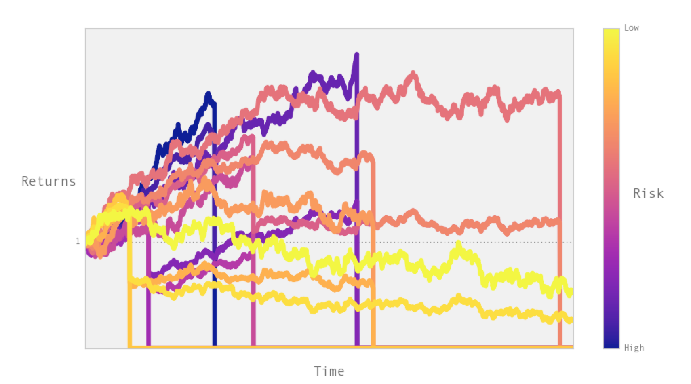
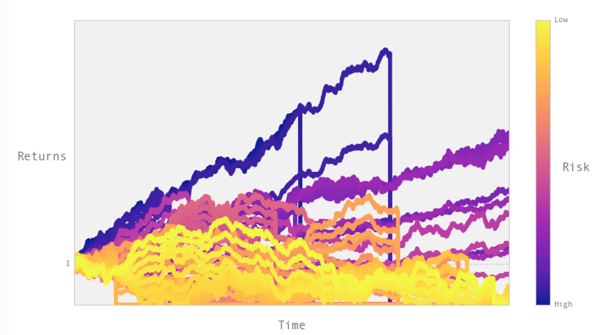

Ruin Simulation
---------------

A simple simulation of risk-taking in a domain where risk premiums come with a
proportional chance of ruin. Based on the real world challenge of trading firms choosing
cryptocurrency exchanges to trade on.

We have a set of traders, T, and a set of exchanges E. Traders are given N 'bets' to
represent trading capital, and allocate these between between exchanges. Traders may
allocate multiple (or all) bets on a single exchange. Exchanges give returns at each
step of the simulation, and each exchange has unique return characteristics determined
by a single parameter 'z'. At a low z, exchanges give high returns, but there is also a
high chance that they will "explode" with a complete loss of funds to their traders. As
z increases, both ruin risk and the excess returns decrease exponentially.

An example with the default settings. 8 exchanges, 2 bets per trader.

If we increase the number of exchanges and traders, and increase the premium decay.

